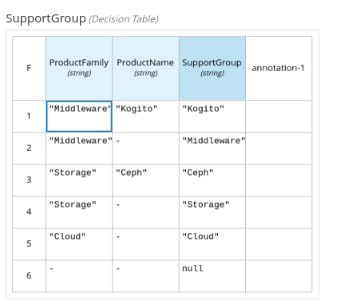

# Flexible process

## Description

A quickstart project that shows the use of flexible processes.

This example shows how to

* make use of ad-hoc subprocesses
* make use of milestones
* make use of DMN business rule integration

### Help Desk process


### Triage decision table



The example shows a help desk process to allow customers creating support cases
that will be assigned to engineers based on the product family and name using
a DMN decision table. If an automatic assignment is not possible, a manual
assignment task will be created.

Once assigned the support case will be set to `WAITING_FOR_OWNER` state meaning
that the engineer has to work on the case and provide a solution or add a
comment asking for more information.

At any moment customers or engineers can add comments until the case is
`CLOSED`.

The case can be set as `RESOLVED` by either an engineer or a customer. Once
this happens a Questionnaire task will be made available where the customer
can provide feedback about the case resolution.

After the Questionnaire submission the case will be `CLOSED` and the process
will terminate.

## Build and run

### Prerequisites

You will need:

* Java 17+ installed
* Environment variable JAVA_HOME set accordingly
* Maven 3.9.6+ installed

When using native image compilation, you will also need:

* GraalVM 21.0.2- (https://github.com/graalvm/graalvm-ce-builds/releases/tag/jdk-21.0.2) installed
* Environment variable GRAALVM_HOME set accordingly
* GraalVM native image needs as well the [native-image extension](https://www.graalvm.org/reference-manual/native-image/)
* Note that GraalVM native image compilation typically requires other packages (glibc-devel, zlib-devel and gcc) to be installed too, please refer to GraalVM installation documentation for more details.

### Compile and Run in Local Dev Mode

```sh
mvn clean compile quarkus:dev
```

NOTE: With dev mode of Quarkus you can take advantage of hot reload for business assets like processes, rules, decision tables and java code. No need to redeploy or restart your running application.

### Package and Run in JVM mode

```sh
mvn clean package
java -jar target/quarkus-app/quarkus-run.jar
```

or on windows

```sh
mvn clean package
java -jar target\quarkus-app\quarkus-run.jar
```

### Package and Run using Local Native Image

Note that this requires GRAALVM_HOME to point to a valid GraalVM installation

```sh
mvn clean package -Pnative
```

To run the generated native executable, generated in `target/`, execute

```{bash}
./target/flexible-process-quarkus-runner
```

## OpenAPI (Swagger) documentation

[Specification at swagger.io](https://swagger.io/docs/specification/about/)

You can take a look at the [OpenAPI definition](http://localhost:8080/q/openapi?format=json) - automatically generated and included in this service - to determine all available operations exposed by this service. For easy readability you can visualize the OpenAPI definition file using a UI tool like for example available [Swagger UI](https://editor.swagger.io).

In addition, various clients to interact with this service can be easily generated using this OpenAPI definition.

When running in either Quarkus Development or Native mode, we also leverage the [Quarkus OpenAPI extension](https://quarkus.io/guides/openapi-swaggerui#use-swagger-ui-for-development) that exposes [Swagger UI](http://localhost:8080/q/swagger-ui/) that you can use to look at available REST endpoints and send test requests.

## Usage example


### Create a support case

Given the following support case:

```{json}
{
  "supportCase": {
    "customer": "Paco the customer",
    "description": "Kogito is not working for some reason.",
    "product": {
      "family": "Middleware",
      "name": "Kogito"
    }
  }
}
```

Create a POST request to the service desk endpoint.

```{bash}

curl -X 'POST' \
  'http://localhost:8080/serviceDesk' \
  -H 'accept: */*' \
  -H 'Content-Type: application/json' \
  -d '{
  "supportCase": {
    "customer": "Paco the customer",
    "description": "Kogito is not working for some reason.",
    "product": {
      "family": "Middleware",
      "name": "Kogito"
    }
  }
}'
```

Expect a response containing the ticket id and the current status of the process data where the engineer is assigned and the state is `WAITING_FOR_OWNER`. Note that also a Location HTTP Header
is present:

```{bash}
 content-length: 303 
 content-type: application/json 
 location: http://localhost:8080/serviceDesk/98b6a1ab-3f94-409f-aa0d-718e9d8ec1be 

{
  "id": "98b6a1ab-3f94-409f-aa0d-718e9d8ec1be",
  "supportCase": {
    "product": {
      "name": "Kogito",
      "family": "Middleware"
    },
    "description": "Kogito is not working for some reason.",
    "engineer": "ken",
    "customer": "Paco the customer",
    "state": "WAITING_FOR_OWNER",
    "comments": null,
    "questionnaire": null
  },
  "supportGroup": "Kogito"
}

```

As this is a flexible process, it is up to the customer or the engineer to decide when the case is `RESOLVED`. Both ends can add comments
and each time a comment is added the state will be updated as waiting for the other party.

There are no pre-existing tasks for adding comments but an endpoint is available to instantiate these ad-hoc tasks.

For that an empty post should be sent to `/serviceDesk/ReceiveSupportComment`. Note the extra flag to retreive the response headers.

```{bash}

  curl -g -X POST \
  "http://localhost:8080/serviceDesk/fd9895ce-0322-4557-a904-11a0d114604a/ReceiveSupportComment/trigger?group=support&user=kelly" \
  -H "Accept: */*" \
  -H "Content-Type: application/json" \
  -d "{}"

```

The below response is returned an HTTP Location header with the endpoint of the generated task. 

In below sample task Id is WorkItemId: `41751bb2-11e3-48d9-ac1d-ee906bbde69c`

```{bash}
Response body
{
  "id": "41751bb2-11e3-48d9-ac1d-ee906bbde69c",
  "nodeInstanceId": "53aee026-ae3b-4da0-adcb-40d71be424ec",
  "nodeId": {},
  "name": "ReceiveSupportComment",
  "state": 1,
  "phase": "activate",
  "phaseStatus": "Activated",
  "parameters": {
    "TaskName": "ReceiveSupportComment",
    "Skippable": "false",
    "GroupId": "support",
    "NodeName": "Receive support comment",
    "UNIQUE_TASK_ID": "_C5983E55-DC49-4839-AC3E-3E8344A29262",
    "supportCase": {
      "product": {
        "name": "Kogito",
        "family": "Middleware"
      },
      "description": "Kogito is not working for some reason.",
      "engineer": "kelly",
      "customer": "Paco the customer",
      "state": "WAITING_FOR_OWNER",
      "comments": null,
      "questionnaire": null
    },
    "supportGroup": "Kogito"
  },
  "results": {},
  "workItemHandlerName": "Human Task",
  "externalReferenceId": "4ebf22b0-21e0-4d87-9b57-52056a558e6f"
}


Response headers

content-length: 2 
 content-type: application/json 
 location: http://localhost:8080/serviceDesk/fd9895ce-0322-4557-a904-11a0d114604a/ReceiveSupportComment/trigger/f4cc8947-6eb6-45bd-b091-052598af9761 

```

The externalReferenceId of the Work Item is the user task instance Id.
 It is important to have in mind the user and group query parameters that provide information about the user performing the task and the group he/she belongs to because
this task is restricted to the _support_ group


### Claim the Task

Once you have the task Id from the previous step, user can claim the task by transitioning it to the "Claim" phase. 
Using the following curl command:

```{bash}

curl -g -X POST \
  "http://localhost:8080/usertasks/instance/4ebf22b0-21e0-4d87-9b57-52056a558e6f/transition?group=support&user=kelly" \
  -H "Accept: application/json" \
  -H "Content-Type: application/json" \
  -d "{ \
    \"transitionId\": \"claim\", \
    \"data\": {} \
  }"

```
Sample Response:

```{bash}
{
  "id": "4ebf22b0-21e0-4d87-9b57-52056a558e6f",
  "userTaskId": "_C5983E55-DC49-4839-AC3E-3E8344A29262",
  "status": {
    
  },
  "taskName": "ReceiveSupportComment",
  "taskDescription": null,
  "taskPriority": null,
  "potentialUsers": [],
  "potentialGroups": [
    "support"
  ],
  "adminUsers": [],
  "adminGroups": [],
  "excludedUsers": [],
  "externalReferenceId": "f4cc8947-6eb6-45bd-b091-052598af9761",
  "actualOwner": "kelly",
  "inputs": {
    "supportCase": {
      "product": {
        "name": "Kogito",
        "family": "Middleware"
      },
      "description": "Kogito is not working for some reason.",
      "engineer": "kelly",
      "customer": "Paco the customer",
      "state": "WAITING_FOR_OWNER",
      "comments": null,
      "questionnaire": null
    },
    "supportGroup": "Kogito"
  },
  "outputs": {
    "comment": ""
  },
  "metadata": {
    "ProcessType": "BPMN",
    "ParentProcessInstanceId": null,
    "ProcessVersion": "1.0",
    "RootProcessInstanceId": null,
    "RootProcessId": null,
    "NodeInstanceId": "e0fa3297-69f7-4e92-9066-211e2013b189",
    "ProcessId": "serviceDesk",
    "ProcessInstanceId": "fd9895ce-0322-4557-a904-11a0d114604a",
    "ProcessInstanceState": 1
  }
}
```

### Add Output Comments

To add comments to the task, use the following curl command:

```{bash}

curl -g -X PUT \
  "http://localhost:8080/usertasks/instance/4ebf22b0-21e0-4d87-9b57-52056a558e6f/outputs?group=support&user=kelly" \
  -H "Accept: application/json" \
  -H "Content-Type: application/json" \
  -d "{\"comment\":\"Task completed.\"}"

  ```

  Sample Response

```{bash}
  {
  "id": "4ebf22b0-21e0-4d87-9b57-52056a558e6f",
  "userTaskId": "_C5983E55-DC49-4839-AC3E-3E8344A29262",
  "status": {
    "terminate": null,
    "name": "Ready"
  },
  "taskName": "ReceiveSupportComment",
  "taskDescription": null,
  "taskPriority": null,
  "potentialUsers": [],
  "potentialGroups": [
    "support"
  ],
  "adminUsers": [],
  "adminGroups": [],
  "excludedUsers": [],
  "externalReferenceId": "f4cc8947-6eb6-45bd-b091-052598af9761",
  "actualOwner": null,
  "inputs": {
    "supportCase": {
      "product": {
        "name": "Kogito",
        "family": "Middleware"
      },
      "description": "Kogito is not working for some reason.",
      "engineer": "kelly",
      "customer": "Paco the customer",
      "state": "WAITING_FOR_OWNER",
      "comments": null,
      "questionnaire": null
    },
    "supportGroup": "Kogito"
  },
  "outputs": {
    "comment": "Task completed."
  },
  "metadata": {
    "ProcessType": "BPMN",
    "ParentProcessInstanceId": null,
    "ProcessVersion": "1.0",
    "RootProcessInstanceId": null,
    "RootProcessId": null,
    "NodeInstanceId": "e0fa3297-69f7-4e92-9066-211e2013b189",
    "ProcessId": "serviceDesk",
    "ProcessInstanceId": "fd9895ce-0322-4557-a904-11a0d114604a",
    "ProcessInstanceState": 1
  }
}
```
### Complete the Task

To mark the task as completed, use the following curl command:

```{bash}

curl -g -X POST \
  "http://localhost:8080/usertasks/instance/4ebf22b0-21e0-4d87-9b57-52056a558e6f/transition?group=support&user=kelly" \
  -H "Accept: application/json" \
  -H "Content-Type: application/json" \
  -d "{\"transitionId\":\"complete\",\"data\":{}}"

```
Sample Response

```{bash}
{
  "id": "4ebf22b0-21e0-4d87-9b57-52056a558e6f",
  "userTaskId": "_C5983E55-DC49-4839-AC3E-3E8344A29262",
  "status": {
    "terminate": "COMPLETED",
    "name": "Completed"
  },
  "taskName": "ReceiveSupportComment",
  "taskDescription": null,
  "taskPriority": null,
  "potentialUsers": [],
  "potentialGroups": [
    "support"
  ],
  "adminUsers": [],
  "adminGroups": [],
  "excludedUsers": [],
  "externalReferenceId": "f4cc8947-6eb6-45bd-b091-052598af9761",
  "actualOwner": "kelly",
  "inputs": {
    "supportCase": {
      "product": {
        "name": "Kogito",
        "family": "Middleware"
      },
      "description": "Kogito is not working for some reason.",
      "engineer": "kelly",
      "customer": "Paco the customer",
      "state": "WAITING_FOR_OWNER",
      "comments": null,
      "questionnaire": null
    },
    "supportGroup": "Kogito"
  },
  "outputs": {
    "comment": "Task completed."
  },
  "metadata": {
    "ProcessType": "BPMN",
    "ParentProcessInstanceId": null,
    "ProcessVersion": "1.0",
    "RootProcessInstanceId": null,
    "RootProcessId": null,
    "NodeInstanceId": "e0fa3297-69f7-4e92-9066-211e2013b189",
    "ProcessId": "serviceDesk",
    "ProcessInstanceId": "fd9895ce-0322-4557-a904-11a0d114604a",
    "ProcessInstanceState": 1
  }
} 
```
### Verify Task Status

To verify the status of the task, use the following curl command:

```{bash}

curl -g -X GET \
  "http://localhost:8080/serviceDesk" \
  -H "Accept: application/json"

```
Checking the status of the task displays the tasks status as completed.

```{bash}
[
  {
    "id": "fd9895ce-0322-4557-a904-11a0d114604a",
    "supportCase": {
      "product": {
        "name": "Kogito",
        "family": "Middleware"
      },
      "description": "Kogito is not working for some reason.",
      "engineer": "kelly",
      "customer": "Paco the customer",
      "state": "WAITING_FOR_CUSTOMER",
      "comments": [
        {
          "author": "kelly",
          "date": "2025-06-18T14:55:23.685957+05:30",
          "text": "Task completed."
        }
      ],
      "questionnaire": null
    },
    "supportGroup": "Kogito"
  }
]
```

